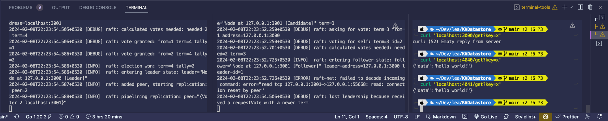

# DKVDatastore
Minimal distributed key-value datastore

This is a minimal key value store written in golang, uses concepts of distributed computing and raft consensus algorithm. Uses the hashicorp's raft library. 

*Note*: This project is simply to gain more knowledge on the raft consensus algorithm. 


## Usage


In terminal 1:
```bash
./KVDatastore node_id 1 raft_port 3000 http_port 4040
```


In terminal 2:
```bash
./KVDatastore node_id 2 raft_port 3001 http_port 4041  
```


In terminal 3:
```bash
curl 'localhost:4040/join?followerAddr=localhost:3001&followerId=2'
```

```bash
curl -X POST 'localhost:4040/set' -d '{"key": "x", "value": "hello world!"}' -H 'content-type: application/json'
```

```bash
curl 'localhost:4040/get?key=x'
```

```bash
curl 'localhost:4041/get?key=x'
```


## Todo
- [ ] Containerize the project
- [ ] Test cases


## References
Based on [A minimal distributed key-value database with Hashicorp's Raft library](https://notes.eatonphil.com/minimal-key-value-store-with-hashicorp-raft.html)